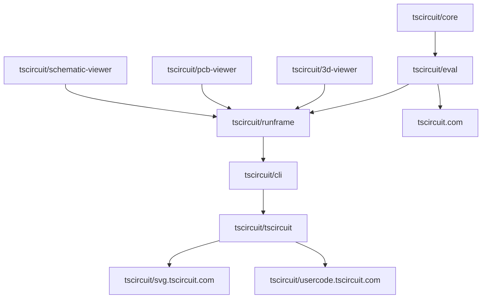

This is a Nitro project for tracking the status of feature/fix releases in the
tscircuit release pipeline.

tscircuit repos get PRs merged against main, these PRs then move downstream
through @tscircuitbot PRs that are automatically merged and increment
package.json versions.

The goal of this project is to track the status of these PRs so authors can see
when their PRs move downstream.

The following diagram shows the flow of PRs through the release pipeline:

> Note: The release pipeline is a tree



A common scenario is someone merges a PR to core that e.g. "Introduce Ground Pours".
The author will then come to the release tracker and see the state of their PR
in a table like this:

| Repo      | Version | Merged Features                                   | Queued Features          | Upstream Features        |
| --------- | ------- | ------------------------------------------------- | ------------------------ | ------------------------ |
| core      | 0.1.2   | "Introduce Ground Nets", "Introduce Ground Pours" |                          |                          |
| eval      | 5.7.2   | "Introduce Ground Nets"                           | "Introduce Ground Pours" | "Introduce Ground Pours" |
| runframe  | 1.1.1   | "Introduce Ground Nets"                           |                          | "Introduce Ground Pours" |
| cli       | 2.2.8   | "Introduce Ground Nets"                           |                          | "Introduce Ground Pours" |
| tscircuit | 3.9.3   | "Introduce Ground Nets"                           |                          | "Introduce Ground Pours" |
| svg       | 9.4.4   | "Introduce Ground Nets"                           |                          | "Introduce Ground Pours" |
| usercode  | 6.7.6   | "Introduce Ground Nets"                           |                          | "Introduce Ground Pours" |

We represent the state of the system in this type:

```tsx
type RepoName = string
type FeatureName = string
type SemverVersion = string
interface ReleaseTrackerState {
  repoGraph: Record<
    RepoName,
    {
      upstream_edge: RepoName
      downstream_edges: RepoName[]
    }
  >
  repoStates: Record<
    `${RepoName}@${SemverVersion}`,
    {
      merged_features: FeatureName[]
      queued_features: FeatureName[]
      upstream_features: FeatureName[]
    }
  >
}
```

The system receives events from the release pipeline and updates the state of the
system. There is also a small web interface to simulate events.

```tsx
type ReleasePipelineEvent = UpdateVersionsEvent | MergeFeatureEvent
type PackageJson = any // TODO package json type

interface UpdateVersionsEvent {
  event_type: "versions_updated"
  repo: RepoName
  version: SemverVersion
  // the package json is used to find upstream repos that were updated
  package_json: PackageJson
}

interface MergeFeatureEvent {
  event_type: "feature_merged"
  repo: RepoName
  feature_name: FeatureName
}
```
