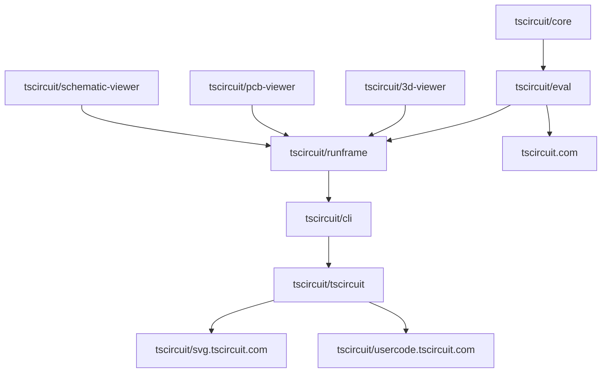

This is a Nitro project for tracking the status of feature/fix releases in the
tscircuit release pipeline.

tscircuit repos get PRs merged against main, these PRs then move downstream
through @tscircuitbot PRs that are automatically merged and increment
package.json versions.

The goal of this project is to track the status of these PRs so authors can see
when their PRs move downstream.

The following diagram shows the flow of PRs through the release pipeline:

> Note: The release pipeline is a tree



A common scenario is someone merges a PR to core that e.g. "Introduce Ground Pours".
The author will then come to the release tracker and see the state of their PR
in a table like this:

| Repo      | Version | Merged Features                                   | Queued Features          | Upstream Features        |
| --------- | ------- | ------------------------------------------------- | ------------------------ | ------------------------ |
| core      | 0.1.2   | "Introduce Ground Nets", "Introduce Ground Pours" |                          |                          |
| eval      | 5.7.2   | "Introduce Ground Nets"                           | "Introduce Ground Pours" | "Introduce Ground Pours" |
| runframe  | 1.1.1   | "Introduce Ground Nets"                           |                          | "Introduce Ground Pours" |
| cli       | 2.2.8   | "Introduce Ground Nets"                           |                          | "Introduce Ground Pours" |
| tscircuit | 3.9.3   | "Introduce Ground Nets"                           |                          | "Introduce Ground Pours" |
| svg       | 9.4.4   | "Introduce Ground Nets"                           |                          | "Introduce Ground Pours" |
| usercode  | 6.7.6   | "Introduce Ground Nets"                           |                          | "Introduce Ground Pours" |

We represent the state of the system in this type:

```tsx
type RepoName = string
type FeatureName = string
type SemverVersion = string
interface ReleaseTrackerState {
  repoGraph: Record<
    RepoName,
    {
      upstream_edge: RepoName
      downstream_edges: RepoName[]
    }
  >
  repoStates: Record<
    `${RepoName}@${SemverVersion}`,
    {
      merged_features: FeatureName[]
      queued_features: FeatureName[]
      upstream_features: FeatureName[]
    }
  >
}
```

The system receives events from the release pipeline and updates the state of the
system. There is also a small web interface to simulate events.

```tsx
type ReleasePipelineEvent = UpdateVersionsEvent | MergeFeatureEvent
type PackageJson = any // TODO package json type

interface UpdateVersionsEvent {
  event_type: "versions_updated"
  repo: RepoName
  version: SemverVersion
  // the package json is used to find upstream repos that were updated
  package_json: PackageJson
}

interface MergeFeatureEvent {
  event_type: "feature_merged"
  repo: RepoName
  feature_name: FeatureName
}
```

Events are POST'd using the `/release_events/create` route

## API Documentation

### Base URL

Production: `https://release-tracker.tscircuit.com`

### Endpoints

#### POST `/release_events/create`

Creates a new release pipeline event (version update or feature merge) and updates the release tracker state.

**Request Body:**

```json
{
  "event": {
    "event_type": "feature_merged" | "versions_updated",
    "repo": "tscircuit/core",
    // For feature_merged:
    "feature_name": "seveibar: Introduce Ground Pours #32",
    // For versions_updated:
    "version": "0.1.2",
    "package_json": {
      "name": "@tscircuit/core",
      "version": "0.1.2",
      "dependencies": {
        "@tscircuit/eval": "^5.7.2"
      },
      "devDependencies": {}
    }
  }
}
```

**Response:**

```json
{
  "success": true,
  "message": "Event created successfully"
}
```

**Error Response:**

```json
{
  "success": false,
  "message": "Error message"
}
```

#### GET `/state`

Retrieves the current state of the release tracker system.

**Response:**

```json
{
  "repoGraph": {
    "tscircuit/core": {
      "upstream_edge": null,
      "downstream_edges": ["tscircuit/eval"]
    },
    "tscircuit/eval": {
      "upstream_edge": "tscircuit/core",
      "downstream_edges": ["tscircuit/runframe", "tscircuit.com"]
    }
  },
  "repoStates": {
    "tscircuit/core@0.1.2": {
      "merged_features": ["Introduce Ground Nets", "Introduce Ground Pours"],
      "queued_features": [],
      "upstream_features": []
    },
    "tscircuit/eval@5.7.2": {
      "merged_features": ["Introduce Ground Nets"],
      "queued_features": ["Introduce Ground Pours"],
      "upstream_features": ["Introduce Ground Pours"]
    }
  }
}
```

#### POST `/state/clear`

Clears all state (resets all repoStates to empty). Useful for testing or resetting the tracker.

**Response:**

```json
{
  "success": true,
  "message": "State cleared successfully"
}
```

#### GET `/`

Serves the web interface for viewing the release tracker state.

## Integration Guide for Package Authors

To integrate the release tracker into your repository's release workflow, you need to send events when:

1. A feature/fix PR is merged to `main`
2. Package versions are updated (typically via automated PRs)

### Determining Your Repo Name

The repo name should match the repository name in the tscircuit organization. For example:

- Repository: `github.com/tscircuit/core` → Repo name: `tscircuit/core`
- Repository: `github.com/tscircuit/tscircuit.com` → Repo name: `tscircuit.com`

### GitHub Actions Workflow Examples

#### 1. Feature Merge Event

Add this to your `.github/workflows/release-tracker.yml` or add it to an existing workflow:

```yaml
name: Release Tracker - Feature Merge

on:
  pull_request:
    types: [closed]

jobs:
  track-feature-merge:
    if: github.event.pull_request.merged == true && github.event.pull_request.base.ref == 'main'
    runs-on: ubuntu-latest
    steps:
      - name: Send feature merge event
        run: |
          FEATURE_NAME="${{ github.event.pull_request.user.login }}: ${{ github.event.pull_request.title }} #${{ github.event.pull_request.number }}"
          curl -X POST https://release-tracker.tscircuit.com/release_events/create \
            -H "Content-Type: application/json" \
            -d "{
              \"event\": {
                \"event_type\": \"feature_merged\",
                \"repo\": \"tscircuit/core\",
                \"feature_name\": \"$FEATURE_NAME\"
              }
            }"
```

**Note:**

- Replace `tscircuit/core` with your actual repo name
- The feature name format is: `author: PR Title #PR_NUMBER` (e.g., `seveibar: Introduce Ground Pours #32`)

#### 2. Version Update Event

When versions are updated (typically in automated PRs from @tscircuitbot), send a version update event:

```yaml
name: Release Tracker - Version Update

on:
  pull_request:
    types: [closed]
    paths:
      - "package.json"

jobs:
  track-version-update:
    if: github.event.pull_request.merged == true && github.event.pull_request.base.ref == 'main'
    runs-on: ubuntu-latest
    steps:
      - uses: actions/checkout@v4
        with:
          ref: ${{ github.event.pull_request.merge_commit_sha }}

      - name: Read package.json
        id: package
        run: |
          VERSION=$(node -p "require('./package.json').version")
          PACKAGE_JSON=$(cat package.json)
          echo "version=$VERSION" >> $GITHUB_OUTPUT
          echo "package_json<<EOF" >> $GITHUB_OUTPUT
          echo "$PACKAGE_JSON" >> $GITHUB_OUTPUT
          echo "EOF" >> $GITHUB_OUTPUT

      - name: Send version update event
        run: |
          curl -X POST https://release-tracker.tscircuit.com/release_events/create \
            -H "Content-Type: application/json" \
            -d "{
              \"event\": {
                \"event_type\": \"versions_updated\",
                \"repo\": \"tscircuit/core\",
                \"version\": \"${{ steps.package.outputs.version }}\",
                \"package_json\": ${{ steps.package.outputs.package_json }}
              }
            }"
```

**Important:** Replace `tscircuit/core` with your actual repo name.

### Alternative: Using a Script

You can also create a script in your repository that can be called from your workflows:

**`scripts/notify-release-tracker.sh`:**

```bash
#!/bin/bash

# Usage: ./scripts/notify-release-tracker.sh <event_type> <repo> [feature_name|version] [package_json_path]

EVENT_TYPE=$1
REPO=$2
TRACKER_URL="https://release-tracker.tscircuit.com/release_events/create"

if [ "$EVENT_TYPE" = "feature_merged" ]; then
  FEATURE_NAME=$3
  # Feature name should be in format: "author: PR Title #PR_NUMBER"
  curl -X POST "$TRACKER_URL" \
    -H "Content-Type: application/json" \
    -d "{
      \"event\": {
        \"event_type\": \"feature_merged\",
        \"repo\": \"$REPO\",
        \"feature_name\": \"$FEATURE_NAME\"
      }
    }"
elif [ "$EVENT_TYPE" = "versions_updated" ]; then
  VERSION=$3
  PACKAGE_JSON_PATH=${4:-package.json}
  PACKAGE_JSON=$(cat "$PACKAGE_JSON_PATH")
  curl -X POST "$TRACKER_URL" \
    -H "Content-Type: application/json" \
    -d "{
      \"event\": {
        \"event_type\": \"versions_updated\",
        \"repo\": \"$REPO\",
        \"version\": \"$VERSION\",
        \"package_json\": $PACKAGE_JSON
      }
    }"
else
  echo "Unknown event type: $EVENT_TYPE"
  exit 1
fi
```

Then call it from your workflow:

```yaml
- name: Track feature merge
  run: |
    chmod +x scripts/notify-release-tracker.sh
    FEATURE_NAME="${{ github.event.pull_request.user.login }}: ${{ github.event.pull_request.title }} #${{ github.event.pull_request.number }}"
    ./scripts/notify-release-tracker.sh feature_merged tscircuit/core "$FEATURE_NAME"
```

### Best Practices

1. **Feature Names**: Use the format `author: PR Title #PR_NUMBER` (e.g., `seveibar: Introduce Ground Pours #32`). This includes:

   - The PR author's GitHub username
   - The PR title
   - The PR number for reference

2. **Version Updates**: Send version update events when:

   - A new version is published to npm
   - A version bump PR is merged
   - After running `npm version` commands

3. **Error Handling**: Consider adding error handling in your workflows:

   ```yaml
   - name: Send event
     continue-on-error: true
     run: |
       # ... curl command ...
   ```

4. **Repo Name Mapping**: If your GitHub repository name doesn't match the expected format, create a mapping:
   ```yaml
   - name: Determine repo name
     id: repo
     run: |
       case "${{ github.repository }}" in
         "tscircuit/tscircuit.com")
           echo "name=tscircuit.com" >> $GITHUB_OUTPUT
           ;;
         *)
           echo "name=${{ github.repository }}" >> $GITHUB_OUTPUT
           ;;
       esac
   ```

### Example: Complete Workflow

Here's a complete example that tracks both feature merges and version updates:

```yaml
name: Release Tracker

on:
  pull_request:
    types: [closed]
    paths:
      - "package.json"
      - "**/*.ts"
      - "**/*.tsx"
      - "**/*.js"
      - "**/*.jsx"

jobs:
  track-release:
    if: github.event.pull_request.merged == true && github.event.pull_request.base.ref == 'main'
    runs-on: ubuntu-latest
    steps:
      - uses: actions/checkout@v4
        with:
          ref: ${{ github.event.pull_request.merge_commit_sha }}

      - name: Track feature merge
        continue-on-error: true
        run: |
          FEATURE_NAME="${{ github.event.pull_request.user.login }}: ${{ github.event.pull_request.title }} #${{ github.event.pull_request.number }}"
          curl -X POST https://release-tracker.tscircuit.com/release_events/create \
            -H "Content-Type: application/json" \
            -d "{
              \"event\": {
                \"event_type\": \"feature_merged\",
                \"repo\": \"tscircuit/core\",
                \"feature_name\": \"$FEATURE_NAME\"
              }
            }"

      - name: Track version update (if package.json changed)
        if: contains(github.event.pull_request.changed_files, 'package.json')
        continue-on-error: true
        run: |
          VERSION=$(node -p "require('./package.json').version")
          PACKAGE_JSON=$(cat package.json)
          curl -X POST https://release-tracker.tscircuit.com/release_events/create \
            -H "Content-Type: application/json" \
            -d "{
              \"event\": {
                \"event_type\": \"versions_updated\",
                \"repo\": \"tscircuit/core\",
                \"version\": \"$VERSION\",
                \"package_json\": $PACKAGE_JSON
              }
            }"
```

**Remember to replace `tscircuit/core` with your actual repository name!**
